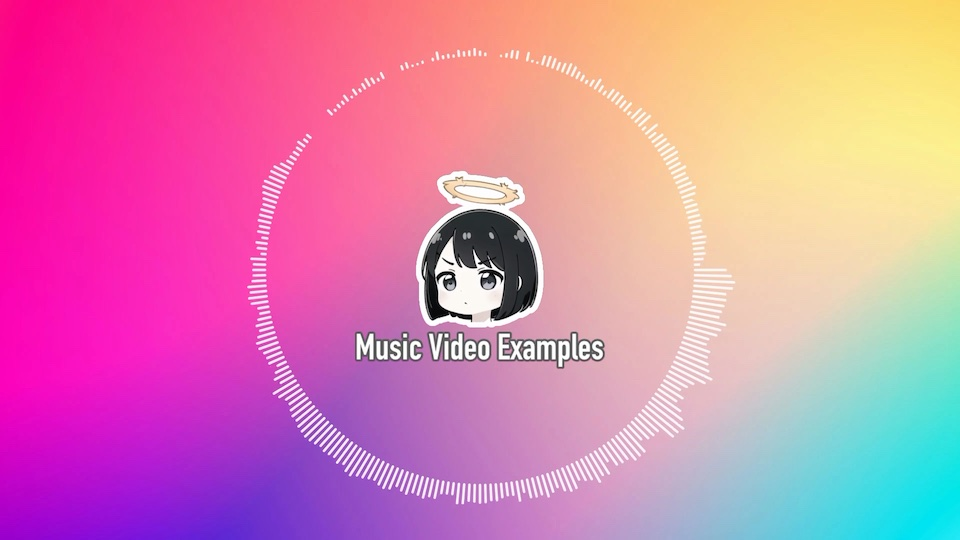

# Enhanced Audio Visualizer



This project allows you to create visually appealing videos with audio waveforms using Python libraries like `librosa`, `PySide6`, and `movis`. With just a few lines of code, you can generate a custom audio visualizer to showcase your musical performances, podcasts, or any other audio.

## Features

- Supports both linear and circular waveform visualizations
- Customizable background and optional logo overlay
- Command-line interface for easy usage
- Extendable for more complex visualizations

## Installation

You'll need Python 3.x and a few dependencies. To install the dependencies, run:

```bash
$ pip install librosa PySide6 scipy
```

For `movis`, you may have to download it from its repository and follow the installation guide.

## Basic Usage

To generate a video with the default settings, simply run:

```bash
$ python3 render.py
```

This will produce a video named `output.mp4` in the current directory.

## Advanced Usage

You can customize various aspects of the visualizer using command-line arguments.

### Specifying the Type of Waveform

You can choose between a linear (`line`) or circular (`circle`) waveform using the `--type` option:

```bash
$ python3 render.py --type circle -i music.mp3 -o output.mp4
```

### Customizing Background

To change the background image, replace the file `bg.jpg` in the project directory, or use the `--background` option to specify another image:

```bash
$ python3 render.py --background new_background.jpg
```

### Adding or Removing Logo

By default, a logo is overlaid on the video. You can remove it using the `--no-logo` option:

```bash
$ python3 render.py --no-logo
```

## Code Overview

### Import Libraries

We import various libraries for audio processing (`librosa`), image processing (`PySide6`, `movis`), and argument parsing (`argparse`).

### Functions and Classes

- `get_audio_image`: Processes the audio and converts it into a 2D NumPy array suitable for visualization.
- `FrequencyLayer`: Draws the frequency information using Qt library either as lines or circles based on the specified `mode`.
- `main`: Initializes the scene, adds layers for background and frequency visualization, and writes the video.

## How to Extend

The design of this project allows for easy extension. You can create custom layers and add more advanced features like interactive elements or real-time updates.

## Sample Videos

Sample videos can be created using the commands mentioned above. Experiment with different types of waveforms, backgrounds, and audio files to generate your own unique visualizations.
