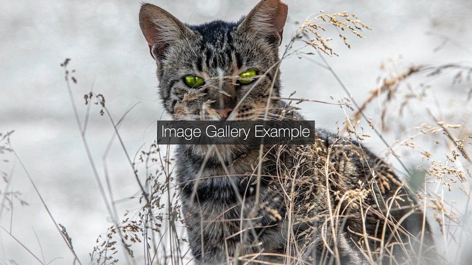

# Image Gallery Video Using Movis Library



This Python sample code demonstrates how to create an image gallery video using the Movis library (`movis` as `mv`). It also uses Pandas (`pd`) to manage the timeline of images.

## Overall Structure

The code consists of two main functions:

1. `make_logo(text: str, duration: float, font_size: int, margin_x: int = 20, margin_y: int = -20)`: Generates a text layer that acts as the title for each image.
2. `main()`: The main function where the video composition takes place.

---

## Function Breakdown

### Make Logo Function

```python
def make_logo(text: str, duration: float, font_size: int, margin_x: int = 20, margin_y: int = -20):
    # ... code ...
    return title
```

This function creates a text layer to act as the title for each image. Here's what it does:

- Creates a text layer with specified parameters like `font_family`, `font_size`, `font_style`, etc.
- Adds a rectangle around the text for better visibility.
- Applies motion to the rectangle and text to make them appear and disappear smoothly.

### Main Function

```python
def main():
    # ... code ...
    scene.write_video('output.mp4')
```

This is where the magic happens:

1. It defines the video size as `(1920, 1080)` and creates a DataFrame for the timeline of images and their properties.
2. Adds a background layer to the scene.
3. Iterates over the timeline DataFrame and adds each image and title to the scene.
4. Adds fade-in and fade-out effects to the first and last images.
5. Writes the final output to an `output.mp4` video file.

---

## Key Components in Main Function

### DataFrame for Timeline

A DataFrame is used to manage the timeline of images, their duration, title, and title position.

```python
timeline = pd.DataFrame([
    {'duration': 5.0, 'image': 'images/erik-karits.jpg', 'title': 'Image Gallery Example', 'title_position': 'center'},
    # ... more rows ...
])
```

### Adding Layers and Effects

The code adds each image and corresponding title as layers in the scene. It also adds fade-in and fade-out effects to make transitions smooth.

```python
scene.add_layer(
    make_logo(row['title'], duration=T, font_size=64),
    offset=time, position=position, origin_point=origin_point)
```

### Writing the Video

Finally, it writes the composition to a video file.

```python
scene.write_video('output.mp4')
```
