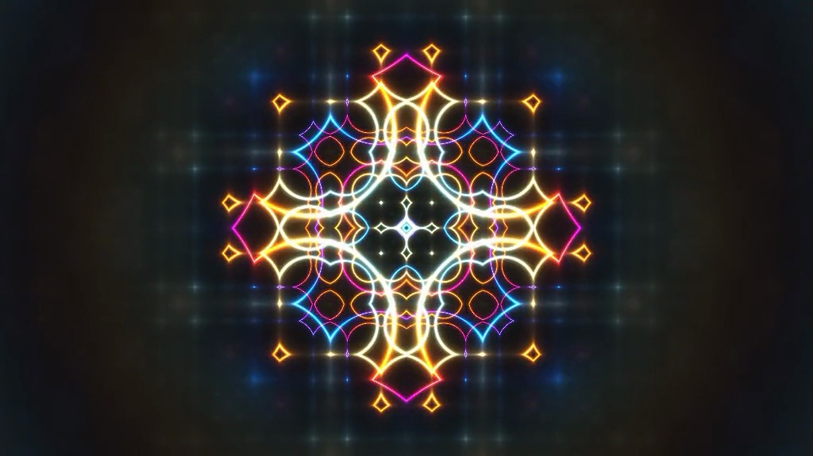

# Shader Art Example with Optimization Note



This sample code demonstrates how to generate a shader art video using Python and the Movis library (`movis` as `mv`). It also uses NumPy (`np`) for numerical operations.

> **Optimization Note**: Some other samples for shader art make use of the `jax` library for speeding up numerical computations. If performance is a concern, you may look into those examples as well.

## Overall Structure

The code has several functions:

1. `palette(t: np.ndarray) -> np.ndarray`: Generates the color palette based on a time variable `t`.
2. `length(x: np.ndarray) -> np.ndarray`: Computes the length of a vector `x`.
3. `fract(x: np.ndarray) -> np.ndarray`: Calculates the fractional part of a number `x`.
4. `render(time: float, size: tuple[int, int], eps: float = 1e-8) -> np.ndarray`: Main rendering function which creates the final image at each frame based on the `time` and the `size` of the frame.

Lastly, it sets up the scene and renders the video.

---

## Function Breakdown

### Palette Function

```python
def palette(t: np.ndarray) -> np.ndarray:
    # ... code ...
    return a + b * np.cos(6.28318 * (c * t + d))
```

The function takes a time array and uses trigonometric and linear functions to produce a color array. This array will later be used to paint the pixels on the screen.

### Length Function

```python
def length(x: np.ndarray) -> np.ndarray:
    return np.sqrt(np.sum(x * x, axis=0))
```

This function calculates the length of a vector `x` using the formula for Euclidean distance.

### Fract Function

```python
def fract(x: np.ndarray) -> np.ndarray:
    return x - np.floor(x)
```

Returns the fractional part of each element in the array `x`.

### Render Function

```python
def render(time: float, size: tuple[int, int], eps: float = 1e-8) -> np.ndarray:
    # ... code ...
```

This is the main rendering function. It uses the time variable to animate the shader and other helper functions to perform operations that influence the look of the generated art.

- `time`: Current time value for animation
- `size`: Dimensions of the output image
- `eps`: A small value to prevent division by zero in calculations

---

## Main Program

```python
if __name__ == '__main__':
    scene = mv.layer.Composition((1024, 576), 10.0)
    scene.add_layer(partial(render, size=scene.size))
    scene.write_video('shader_art_intro.mp4')
```

Here, the program defines the scene size as `(1024, 576)` and the duration as `10.0` seconds. Then it adds the `render` layer and writes the final output to a video file named `shader_art_intro.mp4`.

> **Note**: The code has been adapted from a [YouTube video](https://www.youtube.com/watch?v=f4s1h2YETNY), which can be found in the comments within the code.

And that's it! This is how the Movis library can be used to generate shader art in Python. If you're interested in optimization, don't forget to explore other examples that make use of the `jax` library for faster numerical computations.