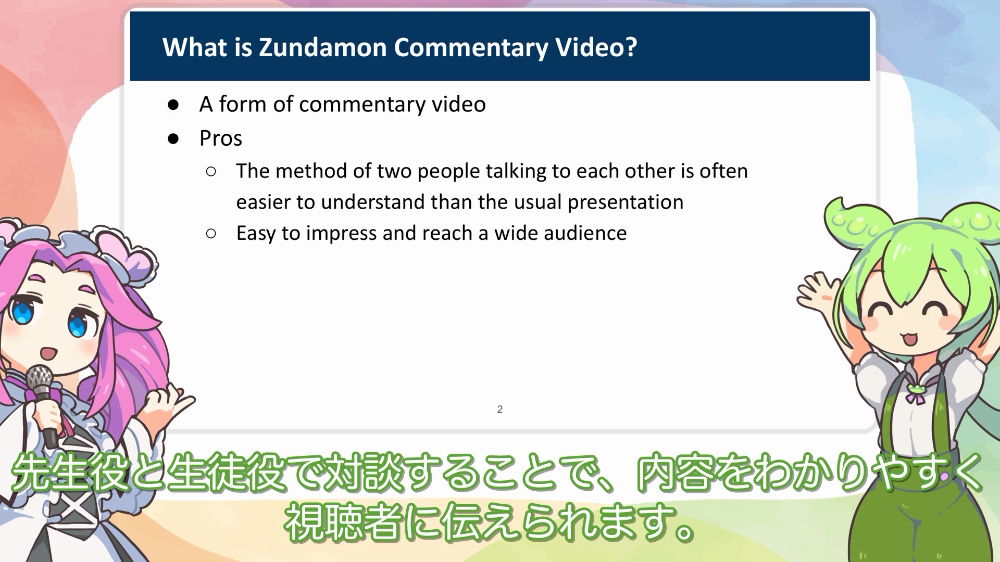
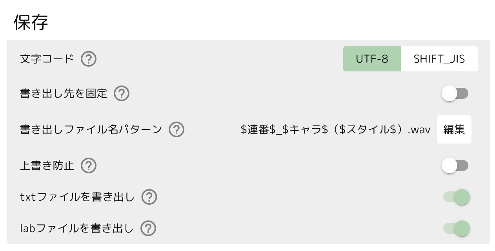

# Zundamon commentary video (ずんだもん解説動画)



The video format in which two characters, *Zundamon* and *Shikoku Metan*, talk to each other along with slides is generally called *Zundamon commentary video*. This sample contains scripts and materials for creating such Zundamon videos.

スライドと共に、ずんだもんと四国めたんという2人のキャラクターが対談する動画形式は、一般にずんだもん解説動画と呼ばれます。このサンプルはこのようなずんだもん動画を作るためのスクリプトと素材を格納しています。

## How to use (動かし方)

A video is created by executing `make_video.py`. Please execute the following:

動画は `render.py` を実行することで作られます。次のコマンドを実行してみましょう。

```bash
$ python3 render.py
```

It will export the subtitle file, dialogs, etc. and generate `outputs/video.mp4`.

字幕ファイル、ダイアログなどが書き出され、 `outputs/video.mp4` が生成されました。

If you read the contents of `render.py`, you will see that the whole content is controlled by a timeline file called ``outputs/timeline.tsv``, which is generated by running the following.

`render.py` の中身を読むと、 ``outputs/timeline.tsv`` というタイムラインファイルによって全体が制御されていることが分かります。
このタイムラインファイルは、次のスクリプトを実行することで生成されます:

```bash
$ python3 make_timeline.py
```

You can control the content by writing the necessary values for facial expressions and slide feeds in `timeline.tsv`.
If you find a typo in the speech synthesis or want to modify the text, you can run `python3 make_timeline.py` in the same way.
The values will not be initialized and the insertions and deletions should remain in the timeline file as they do in git conflicts.
After merging with it, you can run `render.py` again and it will generate the updated video.

この `timeline.tsv` に、表情やスライド送りに必要なキーを書き込むことで制御できます。
もし途中で音声合成にtypoが見つかったり、文章を修正したいと思った場合は、同じように `make_timeline.py` を実行してみましょう。
キーが初期化されることなく、挿入や削除がgitのコンフリクト時のような形でタイムラインに残るはずです。
これを使ってマージした後に、再び `make_video.py` を実行すれば更新された動画が生成されるでしょう。

## Make your own explanatory video (自分で解説動画を作ってみる)

In this example, we consider using [VOICEVOX](https://voicevox.hiroshiba.jp/) to synthesize speech.
This example is expected to generate speech with the following settings.

今回は、[VOICEVOX](https://voicevox.hiroshiba.jp/)を使って音声合成を行うことを考えてみます。
サンプルでは、次のような設定で音声を生成することが期待されています。



Once the script is complete, all that remains is to write out all the audio files in the `audio` directory and the video will be generated.

完成したら、あとは `audio` ディレクトリ内にファイルを書き出せば、ひとまずテンプレート動画は完成するはずです。

## Prepare images (画像を準備する)

At the moment, the character images provided only include the minimum number of expressions needed to run the sample. If you wish to create additional expressions, you need to prepare images by following these steps:

1. Download Zundamon's material from an appropriate URL. This sample utilizes image materials from [Sakamoto Ahiru-san](https://seiga.nicovideo.jp/seiga/im10788496).
2. Extract the expressions from the downloaded PSD file and save them as PNG files.
3. Place the saved PNG files in the images/zundamon directory.
4. For Shikoku Metan, who is the partner character, please follow the same procedure.

現在、キャラクターの画像は、サンプルを動かすための最低限の表情しか提供されていません。
もし自分で別の表情を作りたい場合には、次の手順で画像を準備する必要があります。

1. ずんだもんの素材を適当なURLからダウンロードします。本サンプルは[坂本アヒルさまの画像素材](https://seiga.nicovideo.jp/seiga/im10788496)を利用しています。
2. ダウンロードしたpsdファイルから、表情を切り出し、pngファイルとして保存します。
3. 保存したpngファイルを、`images/zundamon` ディレクトリに配置します。
4. 相方である四国めたんに関しても、同様の手順で行います。

## Reference

* 音声ソフト：VOICEVOX(ずんだもん) https://voicevox.hiroshiba.jp/
* 立ち絵：坂本アヒル様 https://seiga.nicovideo.jp/seiga/im10788496