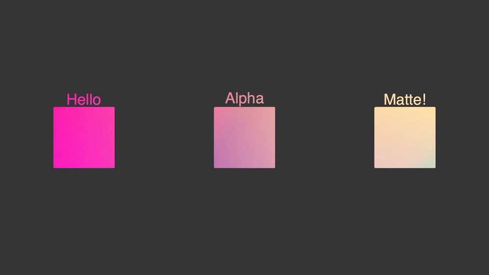

# Example of alpha matte



In this sample, we will see layer composition with alpha-matting. Alpha matte is a feature in typical image editing software that allows you to overwrite a layer with another layer without changing the alpha channel of the target layer. In this library, this feature can be activated with the following:

```python
composition.add_layer(mv.layer.AlphaMatte(mask_layer, target_layer))
```

See `render.py` for details.