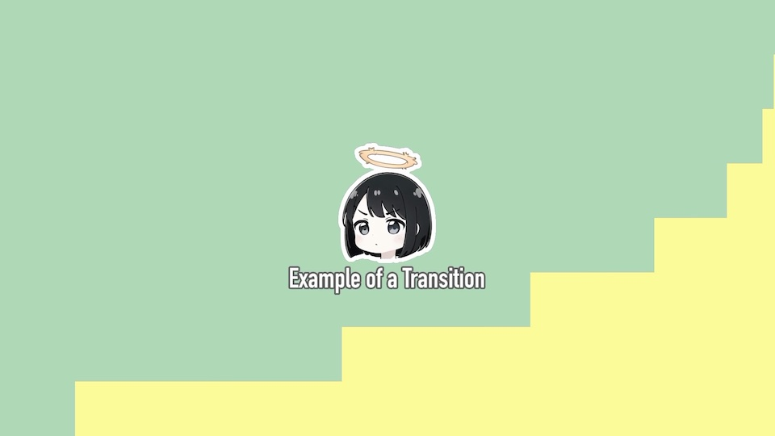

# Example of user-defined transition effect

In this sample, we provide code for adding transition effects between scenes,
allowing users to add their own effects.

A common method to add transition effects is to insert additional illustrations 
between scenes and introduce animation effects to smoothly connect them.
The simplest method is to animate the alpha channel of the illustrations with
a ``mv.layer.LuminanceMatte``, but here we will handle it by adding user-defined effects. The advantage of this method is that it can add more flexible transition effects compared to composition-based animations, but the downside is that it requires writing some ``numpy`` code.

To implement user-defined effects, basically, all you have to do is implement a function that receives the previous image (``numpy.ndarray``) and time (``float``) and returns ``ndarray``. For learning purposes, we are also implementing ``get_key`` method used for caching here, but if you do not use the caching feature, you do not have to implement it. For details, please refer to ``render.py``.