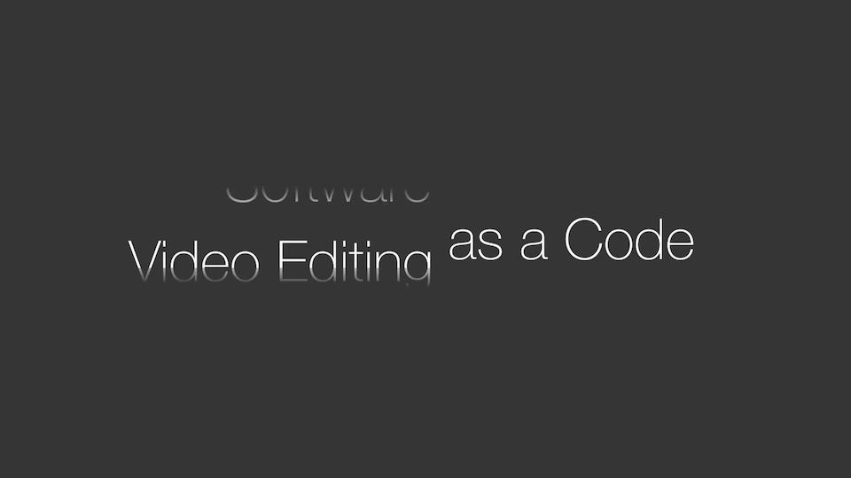

# Example of luminance matte



In this sample, we introduce a method to generate videos using a luminance matte.

A luminance matte is useful when you want to hide a part of a layer.
In this example, we use a luminance matte to achieve an effect where
the text gradually fades out as it moves upward.
In movis, a luminance matte combines two layers to create a new layer.
The specific code is as follows:

```python
    scene.add_layer(
        mv.layer.LuminanceMatte(matte, text),
        position=(scene_size[0] // 2 + 170, scene_size[1] // 2),
        name='subtitle'
    )
```

Since a luminance matte is also a layer,
it can be freely used within a composition.
For more details, please refer to ``render.py``.