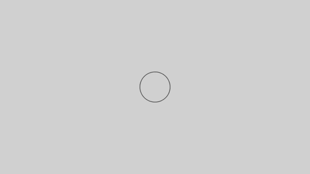

# Example of motion graphics

This sample aims to enable users to create complex layer animations
through the production of simple motion graphics videos.

Compared to GUI-based motion graphics software,
which can be operated intuitively, code-based libraries have
the disadvantage of requiring the writing of non-intuitive extra code.
However, on the other hand, they have the advantage of being able to
address retakes with just a small amount of code modification.
Moreover, they also have the strength of easily controlling
motion graphics that use many layers, such as particles.

The basic flow involves realizing complex shape movements by
combining multiple compositions.
If you want to automatically place many layers and generate complex animations,
it would be effective to use Movis for that cut alone,
and use GUI-based video editing software for other less complex videos.
For more details, please refer to ``render.py``.