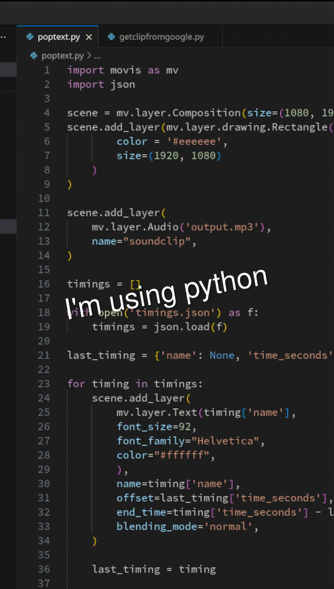

# Example of adding pop text to videos



Have you ever wanted to easily add poptext to your videos for social media?

Movis makes it very easy to add in these effects.

The audio file used here was generated using Google's TTS/STT API. An example input for that API to generate the timings would be:

```
text_input = """
<speak>
    I'm using python<mark name="I'm using python"/>
    to generate<mark name="to generate"/>
    pop text!<mark name="pop text"/>
</speak>
"""
```

The result after using Google's Speech-to-Text API is a series of timings transformed into `timings.json` included here.

Using this method, or even creating your own `timings.json`, will produce a video from Movis with pop text over another video or image.

You will need to provide your own OGG clip for this example to run (and obviously change the timings.json or generate it to match your clip).
